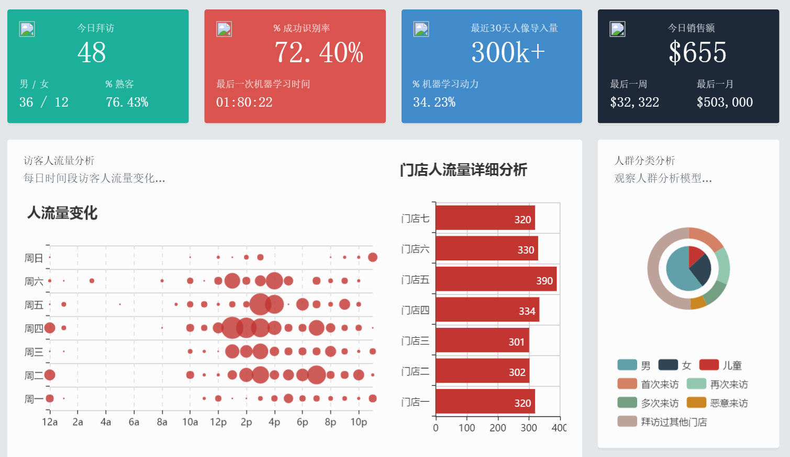

找到你，微软认知服务的商业性应用
===============================================
<h2><a class="anchor" id="user-content-table-of-contents" aria-hidden="true" href="#table-of-contents"></a>目录</h2>

<ul>
<h4><a href="#1">1. 前言</a></h4>
<h4><a href="#2">2. 总体架构设计</a></h4>
<h4><a href="#3">3. 基础工作和概念</a></h4>
<h5><a href="#3.1">3.1 前期准备</a></h5>
<h5><a href="#3.2">3.2 ClientHelper设计实现</a></h5>
<h5><a href="#3.3">3.3 MongoDBHelper设计实现</a></h5>
<h4><a href="#4">4. AIServicesLibrary设计实现</a></h4>
<h5><a href="#4.1">4.1 认知服务的人脸鉴定理解</a></h5>
<h5><a href="#4.2">4.2 PersonFace的设计和实现</a></h5>
<h5><a href="#4.3">4.3 扩展ResultModel</a></h5>
<h5><a href="#4.4">4.4 Verify系成员</a></h5>
<h5><a href="#4.5">4.5 Detect系成员</a></h5>
<h5><a href="#4.6">4.6 Identify系成员</a></h5>
<h5><a href="#4.7">4.7 FindSimilar系成员</a></h5>
<h4><a href="#5">5. AIServicesWebApi设计实现</a></h4>
<h5><a href="#5.1">5.1 PersonGroupController设计实现</a></h5>
<h5><a href="#5.2">5.2 PersonController设计实现</a></h5>
<h5><a href="#5.3">5.3 PersonFaceController设计实现</a></h5>
<h4><a href="#6">6. 最后再说几句</a></li></h4>
</ul>

<h2><a class="anchor" id="user-content-1" aria-hidden="true" href="#1"></a>前言</h2>

        “一个伟大的项目需要有合适的土壤：一个惊艳实用的创意，一个优秀的技术基础平台，一个不懈努力的践行者。”————天眼四骑士

	当“微软认知服务”还是“牛津计划”的时候，当how-old.net作为验证微软也能娱乐化的时候，我们就开始琢磨这套未来无限的平台可以做些什么了。要做一个伟大的项目，我们要有一个很帅气的团队名字，恰好这个时候，我们都看过《NOW YOU SEE ME》，我们觉得天眼这个组织非常酷，强大聪明无所不在的天眼岂不正是AI嘛，所以我们的团队就叫天眼四骑士。

	我们团队在年初就开始研究“微软认知服务”的开发的检验，从构思产品到学习“微软认知服务”的API，断断续续用了不少时间，但是非常有收获，最终内部完成了一个简单可用案例。当完成了技术的初始积累，我们就开始着手去实践我们构思的那个伟大的项目（好像太自夸了）。
  
	这次分享的内容，是我们这个项目中的一个分支，虽然是一个分支，但是我们也将这个分支包装成了一个可实践的商业解决方案。 

	我们设计的场景是一家高端产品销售公司，他们管理着一百多家门店。如何找到和判断潜在客户是他们一直在孜孜不倦研究的方案，但要精确的判断出潜客不可能一个数据源或一个解决方案就可以完成，而如何收集到科学的数据源是我们一直在研究的工作。销售公司的品牌经理、CRM经理、销售经理、门店经理等角色都会关心以下问题：
<ul>
<li>拜访门店的人流量数据，人流量中不同性别的分类数据</li>
<li>拜访门店人群中是否有人在其他时间拜访了同品牌的其他门店门店</li>
<li>拜访门店人群中是否有人以不同的身份和不同的销售进行了接触</li>
<li>拜访者对门店的哪些展品比较感兴趣</li>
<li>拜访者是否还参加过同品牌的其他活动</li>
<li>是否可以将CRM数据和拜访者做识别关联管理</li>
</ul>
	我这个方案就是用来解决这些场景的:在门店和活动现场布置多个摄像头，将拍摄的照片使用“微软认知服务”的人脸识别、分组、鉴定等能力，我们可以计算出人流量、不同门店是否出现过同一个人、指定的人是否在不同活动出现过等等。配合BI的能力，我们提供用户的完美的数据可视化报表：

 

<h2><a class="anchor" id="user-content-2" aria-hidden="true" href="#2"></a>总体架构设计</h2>

	这次的应用需要涉及的面比较多，最重要的是Services和WebApi，我绘制了一个组件图提供大家比较直观的了解总体架构中的组件关系。

 

	Services提供了完善的“微软认知服务”封装，同时我将这个封装设计为一个可移植的组件，这个组建提供了对“微软认知服务”的调用、持久化管理、更强大的业务能力。WebApi是具体的业务应用，但是针对“微软认知服务”WebApi也抽象出了一套业务规则，可以方便的和其他业务应用进行整合。
从上图中可以看到，Services和WebApi有各自的数据存储组件，它们各自维护了自己的数据持久化，确保了组件的内聚能力，当开发人员使用这些组件的时候可以完成透明的开箱即用。

<h2><a class="anchor" id="user-content-3" aria-hidden="true" href="#3"></a><a name="user-content-3">基础工作和概念</a></h2>
<h3><a class="anchor" id="user-content-3.1" aria-hidden="true" href="#3.1"></a><a name="user-content-3.1">前期准备</a></h3>

	首先你需要前往：https://www.azure.cn/cognitive-services注册你的订阅
	然后你需要前往：https://github.com/Microsoft/ProjectOxford-ClientSDK 下载相关平台的Contract代码，Contract包含了认证服务的API返回值的entity，这些代码可以加速我们的开发，也方便大家理解“微软认知服务”
	的数据结构。
	之后建立AIServicesLibrary项目，该项目是一个组件应用，我们需要通过NuGet为项目添加一些必备的开发包
	Newtonsoft.Json
	MongoDB.Driver.Core
	MongoDB.Driver
	MongoDB.Bson
	还需要引用
	System.Drawing
	System.Net.Http

ClientHelper设计实现

ClientHelper封装了对“微软认知服务”的请求， “微软认知服务”提供的不同服务大类的基础url是不同的，比如：
	和人脸有关的是https://api.projectoxford.ai/face/v1.0
	和情绪有关的是https://api.projectoxford.ai/emotion/v1.0/recognize
首先定义了两个readonly的类成员

private readonly string HOST;
private readonly string KEY;

这两个类成员，要求在构造时赋值，同时构造函数还初始化了HttpClient的一些必要参数

/// 

/// 通过基础Url和服务订阅key实例化
/// 

/// <param name="baseUrl"></param>
/// <param name="key"></param>
public ClientHelper(string baseUrl, string key)
{
    HOST = baseUrl;
    KEY = key;
    client = new HttpClient();
    var queryString = HttpUtility.ParseQueryString(string.Empty);
    client.DefaultRequestHeaders.Add("ContentType", "application/json");
    client.DefaultRequestHeaders.Add("Ocp-Apim-Subscription-Key", KEY);
}

 “微软认知服务”不仅仅使用了POST的方式，现在随着业务的复杂，我们不但要实现PUT的方式，而且还需要有些API是没有Requestbody，所以我们要修改POST的方法以适应新的变化

public async Task<ResponseModel> PostAsync(string serviceskey, object body = null, Dictionary<string, string> querystr = null)
{
    var queryString = HttpUtility.ParseQueryString(string.Empty);
    if (querystr != null)
    {
        foreach (var entry in querystr)
        {
            queryString[entry.Key] = entry.Value;
        }
    }
    var uri = string.Format("{0}/{1}?{2}", HOST, serviceskey, queryString);

    //处理没有body的Request 
    if (body == null)
    {
        var response = await client.PostAsync(uri, null);
        var msg = await response.Content.ReadAsStringAsync();
        return new ResponseModel(msg, response.StatusCode);
    }

    byte[] byteData = null;

    if (body.GetType() == typeof(byte[]))
    {
        byteData = (byte[])body;
    }
    else
    {
        var jsonStr = Newtonsoft.Json.JsonConvert.SerializeObject(body);
        byteData = Encoding.UTF8.GetBytes(jsonStr);
    }

    using (var content = new ByteArrayContent(byteData))
    {
        content.Headers.ContentType = body.GetType() == typeof(byte[]) ?
            new MediaTypeHeaderValue("application/octet-stream") :
            new MediaTypeHeaderValue("application/json");
        var response = await client.PostAsync(uri, content);
        var msg = await response.Content.ReadAsStringAsync();
        return new ResponseModel(msg, response.StatusCode);
    }
}

然后我们实现PUT方式

public async Task<ResponseModel> PutAsync(string querkey, object body, Dictionary<string, string> querystr = null)
{
    var queryString = HttpUtility.ParseQueryString(string.Empty);
    if (querystr != null)
    {
        foreach (var entry in querystr)
        {
            queryString[entry.Key] = entry.Value;
        }
    }
    var uri = string.Format("{0}/{1}?{2}", HOST, querkey, queryString);

    byte[] byteData = null;

    if (body.GetType() == typeof(byte[]))
    {
        byteData = (byte[])body;
    }
    else
    {
        var jsonStr = Newtonsoft.Json.JsonConvert.SerializeObject(body);
        byteData = Encoding.UTF8.GetBytes(jsonStr);
    }

    HttpResponseMessage response;
    using (var content = new ByteArrayContent(byteData))
    {
        content.Headers.ContentType = body.GetType() == typeof(byte[]) ?
            new MediaTypeHeaderValue("application/octet-stream") :
            new MediaTypeHeaderValue("application/json");
        response = await client.PutAsync(uri, content);
        var msg = await response.Content.ReadAsStringAsync();
        return new ResponseModel(msg, response.StatusCode);
    }
}
最后我们给出了Class的设计图
 

MongoDBHelper设计实现
我们的服务组件采用MongoDB作为存储介质。同样为了考虑方便分发，我们将数据库的服务位置设计为可配置的

private static string mongoDbServer = ConfigurationManager.ConnectionStrings[Config.MongoDbServerConfigurationNode].ConnectionString;
private static string mongoDbName = ConfigurationManager.AppSettings[Config.MongoDbNameConfigurationNode];

MongoDBHelper要求在构造的时候声明collectionName，以提供对数据集合的处理。

public MongoDBHelper(string collectionName)
{
    client = new MongoClient(mongoDbServer);
    database = client.GetDatabase(mongoDbName);
    collection = database.GetCollection<T>(collectionName);
}

提供了两个属性帮助开发人员了解当前的数据库状态

public string Collection
{
    get
    {
        return collection.CollectionNamespace.CollectionName; ;
    }
}

public string Database
{
    get
    {
        return collection.Database.DatabaseNamespace.DatabaseName;
    }
}

MongoDBHelper提供了非常方便处理数据库的方法，涵盖了CURD，并且可以非常容易的扩展:
	InsertAsync
	SelectOneAsync
	UpdateOneAsync
	DeleteManyAsync

最后我们给出了Class的设计图
 

AIServicesLibrary设计实现
基础类都完成之后就是我们的本篇的第一场重头戏，也是本篇分享最重要的内容:对“微软认知服务”封装一个可以在我所有项目中通过的基础类库，该类库将最大程度的避免调用者去了解“微软认知服务”的细节和API的知识，而且我也希望这套类库具有比较好的通用性，在未来“微软认知服务”升级的时候，我们的类库也能随之提升能力，简单的说就是：高内聚，低耦合。所以我们要求这个组件自我实现数据的持久化，通过MongoDB来管理和“微软认知服务”的交互的结果。
认知服务的人脸鉴定理解
这次我们涉及的API非常多，而且关系复杂，所以我们先说明下本次服务的目标，然后我们阐述下“微软认知服务”中我们会主要用到的FaceAPI的功能。
这次目标是我们将提供一个人脸识别的功能，不要武断的认为这个功能非常简单，我们努力提供用户良好的体验：当我们得到一张用户的照片，我们会判断照片上有几个Face可以识别，并且将识别到的Face和历史数据进行比较，匹配成功的我们将返回该face的拥有着，如果没有匹配成功则将Face作为一个新的人进行标识，并作为下次识别的基础。
为了实现这套功能，我们涉及到的faceAPI有：

API	描述
Detect	Detect human faces in an image and returns face locations, and optionally with face ID, landmarks, and attributes.
Identify	Identify unknown faces from an person group.
Add a Person Face	Add a representative face to a person for identification. The input face is specified as an image with a targetFace rectangle. It returns an persistedFaceId representing the added face and this persistedFaceId will not expire.
Create a Person	Create a new person in a specified person group for identify. A newly created person have no registered face, you can call Person - Add a Person Face API to add faces to the person.
Create a Person Group	Create a new person group with specified person group ID, name and user-provided data.
Train Person Group	Queue a person group training task, the training task may not be started immediately.

这些API体现了“微软认知服务”中一个非常重要的身份鉴定的方案，微软用一张图片非常清晰的表达了
 
我们需要建立一个组，然后为每一个人建立一个列表，当一个人列表中的Face越多，机器学习的精度就越高。为了实现这个概念我们要熟练运用微软认证的FaceAPI系列，我通过一个流程图说明这些API的关系
 

当然在实际的实现上还有非常多的细节要去考虑。

PersonFace的设计和实现

先定义三个成员用于我们和ClientHelper的交互

private const string SERVICE_HOST = "https://api.projectoxford.ai/face/v1.0";
const string KEY = Config.FaceKey;

ClientHelper client;

这三个成员在构造函数时使用
public PersonFace()
{
    client = new ClientHelper(SERVICE_HOST, KEY);
}

整个类的成方法成员我分成三大分类：Detect、Verify、Identify、FindSimilar。其实Verify系成员没有什么太大的用处，仅仅是封装了“微软认知服务”的Verify方法，总体类的设计如下
 
你可以立即观察到一点，所有的数据库的交互成员都是私有的，此外各方法成员有大量的重载，我们在下面的论述中就会详细的讨论。

扩展ResultModel
我们在数据库存储和接受”微软认知服务”的结果进行JSON序列化的时候，我们都希望能通过强类型进行数据类型安全的验证，之前我们前往：https://github.com/Microsoft/ProjectOxford-ClientSDK  获得了微软帮我们定义好了很多“微软认知服务”的结果实体类，但是我们如果要在这些实体类中加入我们自己定义的属性或成员，又不想破坏这样实体，又希望定义的过程简单的话，我们可以定义一个泛型的基类：ModelBase<T>。ModelBase<T>允许我们定义一个适合写入MongoDB的实体类，并且很容易的扩展自己的成员
public abstract class ModelBase<T>
{
    public ObjectId _id { set; get; }
    public T Contract { set; get; }
}

比如我们要实现一个自己的VerifyModel(下文马上就要用到)，我们可以这样做
public class VerifyModel : ModelBase<VerifyResult>
{
    public string FaceID1 { set; get; }
    public string FaceID2 { set; get; }
}

这样，我们马上就快速的拥有了一个扩展了自己成员的ResultModel

Verify系成员
Verify系成员在我们本篇中的地位不算高，而且简单易懂，我们就先从Verify系成员入手。
我们先实现两个数据库的方法，用于检测两个face的比对结果是否已经提交处理过。
private async Task<VerifyModel> GetVerifyResultToDb(string faceId1, string faceId2)
{
    var mongo = new MongoDBHelper<VerifyModel>(Config.VerifyResultTableName);
    var doc = await mongo.SelectOneAsync(x =>
        (x.FaceID1 == faceId1 && x.FaceID2 == faceId2)
        );

    return doc;
}
和
private async Task SetVerifyResultToDb(string faceId1, string faceId2, VerifyResult contract)
{
    var mongo = new MongoDBHelper<VerifyModel>(Config.VerifyResultTableName);
    await mongo.InsertAsync(new VerifyModel()
        {
            FaceID1 = faceId1,
            FaceID2 = faceId2,
            Contract = contract
        });
}

之后我们实现VerifyAsync，而实现的过程非常简单

public async Task<ResponseModel> VerifyAsync(string faceId1, string faceId2)
{
    var serviceskey = "verify";
    //先求是否有历史值
    var dbResult = await GetVerifyResultToDb(faceId1, faceId2);
    if (dbResult != null)
    {
        return new ResponseModel(
            JsonConvert.SerializeObject(dbResult.Contract).ToString(),
            HttpStatusCode.OK
            );
    }

    //将验证的结果存储，便于下次从历史值中提取
    var result = await client.PostAsync(
       serviceskey,
        new
        {
            faceId1 = faceId1,
            faceId2 = faceId2
        }
       );

    await SetVerifyResultToDb(faceId1, faceId2, JsonConvert.DeserializeObject<VerifyResult>(result.Message));
    await SetVerifyResultToDb(faceId2, faceId1, JsonConvert.DeserializeObject<VerifyResult>(result.Message));
    return result;
}

如果你不想阅读代码，理解下面的UML就可以了
 

Detect系成员

Detect系成员是PersonFace中非常重要的的一组成员，他的主要作用是
	判断照片上是否有人脸可以识别
	判断照片上有多少人脸可以识别
	计算出照片上人脸的位置
只有有了Face的数据，我们才能让Identify系成员进一步的处理。但是我们需要提前了解一个知识点：Identify不接受一张照片上同时处理多个Face的提交，所以我们需要自己做些预处理。同时我们为了避免多次重复的提交“微软认知服务”浪费我们昂贵的资源，我们需要对处理的结果持久化已经保存用户提交的照片。
我们先实现对数据库的CURD
Get
private async Task<DetectModel> GetDetectResultFromDB(string pictureId)
        {
            var mongo = new MongoDBHelper<DetectModel>(Config.DetectResultTableName);

            var doc = await mongo.SelectOneAsync(x => x.PictureID == pictureId);
            return doc;
        }

Set
private async Task SetDetectResultToDB(string pictureId, List<Face> contract)
        {
            var mongo = new MongoDBHelper<DetectModel>(Config.DetectResultTableName);
            await mongo.InsertAsync(new DetectModel()
            {
                PictureID = pictureId,
                Contract = contract
            });
        }

Update
private async Task UpdateDetectResultToDB(string pictureId, List<Face> contract)
        {
            var mongo = new MongoDBHelper<DetectModel>(Config.DetectResultTableName);

            var filter = Builders<DetectModel>.Filter.Eq(x => x.PictureID, pictureId);
            var update = Builders<DetectModel>.Update.Set(x => x.Contract, contract);

            await mongo.UpdateOneAsync(filter, update);
        }

Delete
private async Task DeleteDetectResultFromDB(string pictureId)
        {
            var mongo = new MongoDBHelper<DetectModel>(Config.DetectResultTableName);

            var filter = Builders<DetectModel>.Filter.Eq("pictureId", pictureId);
            await mongo.DeleteManyAsync(filter);
        }

接下来，我们来实现DetectAsync成员。DetectAsync成员我们设计了三个重载以应对我设想的三种业务场景

第一个场景：接受一个字节流，但不需要保存图片，这种场景往往用于我们自己测试

public async Task<ResponseModel> DetectAsync(byte[] content)
        {
            var serviceskey = "detect";

            return await client.PostAsync(serviceskey,
                 content,
                 new Dictionary<string, string> {
                    {"returnFaceId","true"},
                    {"returnFaceLandmarks","true"},
                    {"returnFaceAttributes","age, gender, headPose, smile, facialHair, glasses"}
                    }
                 );
        }

第二个场景，接受一个字节流和用户期望的PictureId，将流按PictureId存储在存储设备中。并提供了一个参数:是否需要重新提交“微软认知服务”刷新图片数据

public async Task<ResponseModel> DetectAsync(byte[] content, string pictureId, bool mandatory = false)
        {
            var dbresult = await GetDetectResultFromDB(pictureId);

            //若不进行强制刷新且数据库有请求过的数据，返回数据库查询的数据
            if (!mandatory && dbresult != null)
            {
                return new ResponseModel(JsonConvert.SerializeObject(dbresult.Contract), HttpStatusCode.OK);
            }

            //如果要求强制刷新，则必须重新请求face监测
            //检查照片中的人脸数据
            var newResult = await DetectAsync(content);

            if (newResult.StatusCode == HttpStatusCode.OK)
            {
                if (dbresult != null)
                {
                    await UpdateDetectResultToDB(pictureId, JsonConvert.DeserializeObject<List<Face>>(newResult.Message));
                }
                else
                {
                    await SetDetectResultToDB(pictureId, JsonConvert.DeserializeObject<List<Face>>(newResult.Message));
                }
            }

            return newResult;
        }

第三个场景：用户提供一个PictureId，如果之前有对应PictureId的数据，直接返回
public async Task<ResponseModel> DetectAsync(string pictureId)
        {
            var dbResult = await GetDetectResultFromDB(pictureId);

            if (dbResult != null)
            {
                return new ResponseModel(JsonConvert.SerializeObject(dbResult.Contract),
                   HttpStatusCode.OK
                   );
            }
            else
            {
                return new ResponseModel("404", HttpStatusCode.NotFound);
            }
        }

Identify系成员

当前面的成员方法都完成后，Identify系开始隆重上场。Identify系成员中最最重要的成员是AddPersons，其他所有成员都是围绕着他服务的，实际上在极端情况下，我都认为只要暴露AddPersons成员即可，其他成员都可以私有化，当然了，最后我还是没有这么极端的去实现。要大局观的理解Identify系成员，必须先理解AddPersons的设计，我用了一个UML来描述AddPersons的流程处理
 

上面的UML描述了这样一个流程：
	从照片中获得Face的数据，我们分类为：allIdentifyFaces
	通过IdentifyAsync得到可以识别的Face，我们分类为：knowFaces
	通过对allIdentifyFaces和knowFaces的差值我们得到：unknowFaces
	为unknowFaces的每一个成员创建一个person
	将对应的face和person关联
	通知机器学习

AddPersons的实现如下

public async Task<ResponseModel> AddPersons(byte[] content, string pictureId, string personGroupId)
        {
            //先获得照片中的人脸识别的数据
            var detectResult = await DetectAsync(content, pictureId);
            //所有被识别出来的Faces
            var allIdentifyFaces = JsonConvert.DeserializeObject<List<Face>>(detectResult.Message);

            //对脸部做识别,得到可识别的人脸
            var idResult = await IdentifyAsync(allIdentifyFaces.Select(x => x.FaceId).ToArray(), personGroupId);
            var idResultJson = JsonConvert.DeserializeObject<List<IdentifyResult>>(idResult.Message); 
            var knowFaces = idResultJson.Where(x => x.Candidates.Length > 0);

            Dictionary<string, string> dicPersonFace = new Dictionary<string, string>();
            foreach (var item in knowFaces)
            {
                dicPersonFace.Add(item.FaceId.ToString(), item.Candidates.First().PersonId.ToString());
            }

            //allIdentifyFaces和knowFaces 差值
            var unknowFaceIds = allIdentifyFaces.Select(x => x.FaceId).Except(knowFaces.Select(x => x.FaceId));

            //将匹配的Face关联到对应的Person 
            foreach (var face in knowFaces)
            {
                if (face.Candidates.Length > 0)
                {
                    var rect = allIdentifyFaces.First(x => x.FaceId == face.FaceId).FaceRectangle;
                    await AddPersonFace(
                          personGroupId,
                        face.Candidates[0].PersonId.ToString(),
                          content,
                          new Rectangle(rect.Left, rect.Top, rect.Width, rect.Height)
                          );
                }
            }

            //处理没有匹配的Face
            foreach (var faceId in unknowFaceIds)
            {
                var rect = allIdentifyFaces.First(x => x.FaceId == faceId).FaceRectangle;
                //CreatePerson要求提供person's display name
                var pName = new Guid().ToString();
                var personResult = await CreatePerson(personGroupId, pName, pName);
                var pid = JObject.Parse(personResult.Message)["personId"].ToString();

                await AddPersonFace(
                      personGroupId,
                      pid,
                      content,
                      new Rectangle(rect.Left, rect.Top, rect.Width, rect.Height)
                      );

                dicPersonFace.Add(faceId.ToString(), pid);
            }

            return new ResponseModel(
                JsonConvert.SerializeObject(dicPersonFace),
                HttpStatusCode.OK);
        }

接下来我们逐个来看AddPersons所涉及到的方法。
IdentifyAsync用于验证一组Face中哪些能被认证的，“微软认知服务”对返回的结果会给出一组潜在的可能，并给予评级。不过要注意，每次提交的Face不要超过10个，代码简单的逻辑如下

public async Task<ResponseModel> IdentifyAsync(Guid[] faceids, string persongroupid, int maxNumOfCandidatesReturned = 1)
        {
            var serviceskey = "identify";

            //The algorithm allows more than one face to be identified, but the no more than 10 faces
            var faceList = CommonHelper.ArrayChunks<Guid>(faceids, 10);

            List<IdentifyResult> list = new List<IdentifyResult>();

            //每一组请求一次微软认知服务
            foreach (var faceidArr in faceList)
            {
                var result = await client.PostAsync(serviceskey,
                new
                {
                    personGroupId = persongroupid,
                    faceIds = faceidArr,
                    maxNumOfCandidatesReturned = maxNumOfCandidatesReturned
                }
                );

                if (result.StatusCode == HttpStatusCode.OK)
                {
                    var tempResult = JsonConvert.DeserializeObject<List<IdentifyResult>>(result.Message);
                    if (tempResult.Count > 0)
                    {
                        list.AddRange(tempResult);
                    }
                }
                else
                {
                    return result;
                }
            }

            var jsonresult = JsonConvert.SerializeObject(list);

            return new ResponseModel(jsonresult, HttpStatusCode.OK);
        }

CreatePerson对没有识别的Face作为一个新的Person
public async Task<ResponseModel> CreatePerson(string personGroupId, string personrData)
        {
            var serviceskey = string.Format("persongroups/{0}/persons", personGroupId);
            var result = await client.PostAsync(
               serviceskey,
                new
                {
                    name = personrData,
                    userData = personrData
                }
               );
            return result;
        }

AddPersonFace将Face添加到和他关联的Person中，关联的Face越多，当然判断的精确度就越高。

public async Task<ResponseModel> AddPersonFace(string personGroupId, string personId, byte[] content, Rectangle targetFace)
        {
            var serviceskey = string.Format("persongroups/{0}/persons/{1}/persistedFaces",
                     personGroupId, personId);
            var result = await client.PostAsync(
               serviceskey,
                content,
                new Dictionary<string, string>
                {
                    {"targetFace",string.Format("{0},{1},{2},{3}",targetFace.Left, targetFace.Top, targetFace.Width, targetFace.Height)}
                }
               );
            return result;
        }

TrainPersonGroup是通知机器训练
public async Task<ResponseModel> TrainPersonGroup(string personGroupId)
        {
            var serviceskey = string.Format("persongroups/{0}/train", personGroupId);

            return await client.PostAsync(serviceskey);
        }

FindSimilar系成员
FindSimilar系成员是Identify系成员的重要补充，因为在实际运行中我们发现，当两个face的confidence低于0.5，Identify判断就会失败，而因为角度不同，发型不同或其他原因，一个Person的两个Face的confidence很容易会低于0.5，特别是女生，我实际测试中对女生的百变造型让我头痛不已，所以我设计了FindSimilar系成员来应对这个风险。
基本思路是：当得到一个Face后，无论Identify的结果怎么样，我总会把Face按性别放入不同的FaceList中，所以如果Identify的判断是null，我就遍历所有符合性别的FaceList进行FindSimilar，以得到最相近的Face。但是FindSimilar毕竟不是Identify，所以我们对FindSimilar的结果是保持争议的，因此我将FindSimilar的结果和Person做了关联，未来通过AIServicesWebApi平台提供一个人工干预的功能，将有争议的结果提交个人工判断，如果人工判断为正确，则将该face加入到Person中，为下一次的Identify提供更可靠的判断，同时提升机器学习的能力。如果人工判断为错误，则解除Face和Person的关系。
FindSimilar系最重要的两个成员是AddFaceToList和FindSimilar。AddFaceToList承担了更多的基础工作，比如依据Face的性别建立List，如果原有的List中的Face满了，则再建立新List，将Face按性别添加到不同的List中：
private async Task AddFaceToList(byte[] content, Face face)
        {
            var maxFaceList = await GetMaxFaceListToDb(face.FaceAttributes.Gender);
            var faceListId = maxFaceList.Contract.FaceListId;
            if (maxFaceList.FacesCount == 1000)
            {
                var faceListName = string.Format("{0}_{1}", face.FaceAttributes.Gender, maxFaceList.FacesCount + 1);
                var faceListResult = await CreateFaceList(Guid.NewGuid().ToString(), faceListName, faceListName);
                var faceList = JsonConvert.DeserializeObject<FaceListMetadata>(faceListResult.Message);
                faceListId = faceList.FaceListId;
                await SetFaceListResultToDB(faceList, maxFaceList.FacesCount + 1, face.FaceAttributes.Gender);
            }

            var serviceskey = string.Format("facelists/{0}/persistedFaces", faceListId);

            var result = await client.PostAsync(
            serviceskey,
            content,
            new Dictionary<string, string> {
                {"targetFace",
                    string.Format("{0},{1},{2},{3}",
                    face.FaceRectangle.Left,
                    face.FaceRectangle.Top,
                    face.FaceRectangle.Width,
                    face.FaceRectangle.Height)},
                }
            );

            await SetFaceListCountToDB(faceListId, 1);
        }

FindSimilar就是将Face对所有关联性别的List进行寻找相似，然后将最佳结果集返回
private async Task<List<SimilarPersistedFace>> FindSimilar(Face face)
        {
            var serviceskey = "findsimilars";

            var faceLists = await GetFaceListToDb(face.FaceAttributes.Gender);
            var similarFaces = new List<SimilarPersistedFace>();

            foreach (var facelist in faceLists)
            {
                var result = await client.PostAsync(
                serviceskey,
                new
                {
                    faceId = face.FaceId,
                    faceListId = facelist.Contract.FaceListId,
                    maxNumOfCandidatesReturned=5//这个值未来设计为可配置
                }
                );
                similarFaces.AddRange(JsonConvert.DeserializeObject<List<SimilarPersistedFace>>(result.Message));
            }

            return similarFaces;

        }

AIServicesWebApi设计实现

AIServicesLibrary仅仅封装了“微软认知服务”的使用，但不能比较快捷的和业务系统整合，所以我又设计了一个AIServicesWebApi，这个WebAPI是从业务应用角度出发提供业务系统如何去使用AIServicesLibrary，同时也可以当作AIServicesLibrary的控制管理器来进行观察和管理：比如
	当前有哪些Group，GroupID和业务系统的关系
	组中有哪些Person，PersonID和业务系统的关系
	Person和哪些Face关联
	有哪些Face不属于目前的Person，是认知服务识别错了，提供手工干预
	有哪些Face没有被正确关联，需要手工干预
	Person中关联的Face进行替换以提高更优质的学习方式

数据库我采用PostgreSQL，原因很简单，支持的类型比较多，比如NpgsqlBox、IPAddress、JSON等比较符合我的需求，我用的是Npgsql，一个使用纯C#实现的.NET data provider，也支持Entity Framework 6，可惜的是Entity Framework 模式不支持对JSON类型的产销，所以我在代码中处于不同环境混合使用Entity Framework 模式和ADO.Net模式。
	我们的服务层提供了PersonGroupController、PersonController、PersonFaceController、EmotionController但实际上通过RouteAttribute的修饰，在Url上用户的体验非常统一。
	在设计上我希望和外部的业务系统的数据的关系不能太耦合，相互之间仅依赖一个id进行交互，但同时我又不希望外部业务系统为了接入我们的服务有太大的改动，所以我们对id的设计需要多考虑。比如用户在我们的服务中添加一个用户组织机构中的一个用户，这个用户必然有用户业务系统的标识，但“微软认知服务”对为每一个添加的Person提供一个PersonID，所以我们要妥善管理这两个标识的关系。所以我的构思是这样的
 
	Id：认知服务创建的标识
	UseData:客户业务系统提供的标识
当业务系统向服务平台添加一个资源的时候，平台只返回一个标识，这个标识的情况有两种：
	如果用户不提供标识: AIServicesWebApi将“微软认知服务”提供的标识作为UserData
	如果用户提供标识:则UserData为用户提供标识
PersonGroupController设计实现
PersonGroupController用于管理组，我给出了get的Rotue的设计
 

用户业务系统可以用PersonGroupController创建自己的组织结构，将不同的需要鉴定身份的人放在不同的组中。
为了方便业务系统的时候，我设计的返回的model
 
[System.Web.Http.Route("persons/group/{persongroupKey}")]
public async Task<HttpResponseMessage> Get(string persongroupKey)
        {

            var persongroup = await db.PersonGroups.FindAsync(persongroupKey);

            if (persongroup == null)
            {
                return Request.CreateResponse(HttpStatusCode.NoContent);
            }

            if (persongroup.IsDelete == true)
            {
                return Request.CreateResponse(HttpStatusCode.NoContent);
            }

            var personGroupResult = new
            {
                key = persongroup.UserData,
                personCount = persongroup.PersonsCount,
                picturesCount = persongroup.PicturesCount,
                man = persongroup.MenCount,
                woman = persongroup.FemalesCount,
                createDate = persongroup.CreateTime,
                lastAddPersonDate = persongroup.LastAddPersonDate,
                LastMachineLearningDate = persongroup.LastTrainTime

            };

            return Request.CreateResponse(HttpStatusCode.OK, personGroupResult);
        }

PersonController设计实现
PersonController用于帮助用户管理组内的成员，get的设计部分如下

 

同样PersonController的设计要点同样是返回值，我设计的返回类，这个类返回了大量Person的信息，为业务提供了很多有价值的值。

 

[System.Web.Http.Route("persons/person/persongroup/{persongroupKey}/index/{page:int}/{pageSize:int}")]
public async Task<HttpResponseMessage> Get(string persongroupKey, int page, int pageSize)
        {
            var list = await db.Persons.Where(x => x.IsDelete == false && x.PersonGroupID == persongroupKey).OrderByDescending(x => x.CreateTime).Skip((page - 1) * pageSize).Take(pageSize).ToListAsync();

            var result = (from l in list
                          select new
                          {
                              key = l.UserData,
                              personGroupID = l.PersonGroupID,
                              facesCount = l.FacesCount,  
                              highQualityCount = l.HighQualityCount,
                              lowQualityCount = l.LowQualityCount,
                              lastMachineLearningDate = l.LastMachineLearningDate,
                              learningQueueCount = l.LearningQueueCount,  
                          }).ToList();

            return Request.CreateResponse(HttpStatusCode.OK, result);
        }

PersonFaceController设计实现
PersonFaceController是服务平台最重要的入口，它提供了几个重要的行为
	将Face和PersonGroup中的Person绑定
	将Face添加到PersonGroup中，并创建一个Person
	返回Face所在的原始的照片，因为照片上也许有多个人，所以同时返回Rect帮助标注出face在照片上的位置
	返回Face的独立照片，所谓独立照片是将Face从照片中多个Face中提取出来，作为独立的照片返回，这个方法是比较重要的
	将一张质量不高的照片从机器学习中移除
	观察和了解目前用于机器学习的Face的质量情况
	返回照片信息的时候，同时返回情感数据，所以用户其实是看不到EmotionController的

UML说明了几个重要的get方法
 

我们来分享下其中一些重要的方法的实现。
返回face的原始照片
[System.Web.Http.Route("persons/face/origina/{faceKey}")]
public async Task<HttpResponseMessage> GetOriginalPhoto(string faceKey)
        {
            var personface = await db.PersonFaces.FindAsync(faceKey);

            if (personface == null)
            {
                return Request.CreateResponse(HttpStatusCode.NoContent);
            }           

            var result = new
            {
                rect = personface.Rectangle,
                image = await FileHelper.CreateImgToBase64(personface.FileID)
            };           

            return Request.CreateResponse(HttpStatusCode.OK, result);
        }

最有意思的就是下面这个方法，返回Face的独立照片

[System.Web.Http.Route("persons/face/thumbnai/{faceKey}")]
public async Task<HttpResponseMessage> GetThumbnailPhoto(string faceKey)
        {
            var personface = await db.PersonFaces.FindAsync(faceKey);

            if (personface == null)
            {
                return Request.CreateResponse(HttpStatusCode.NoContent);
            }

            var result = new
            {
                originaContent = FileHelper.ReadAsync(personface.FileID),
                thumbnaiContent = FileHelper.ExtractFace(personface.FilePath, new List<Rectangle>() { new Rectangle(Convert.ToInt32(personface.Rectangle.Left), Convert.ToInt32(personface.Rectangle.Top), Convert.ToInt32(personface.Rectangle.Width), Convert.ToInt32(personface.Rectangle.Height)) }).First()
            };

            return Request.CreateResponse(HttpStatusCode.OK, result);
        }

最后再说几句

到目前为止，我们已经详细讨论了认知服务的封装和设计一个可独立使用又可以和业务系统整合的WebAPI服务。但是要实现首页给的图，不是本篇做讨论的，那需要和BI领域整合，希望我们可以在下一篇“微软认证服务的数据分析”中讨论。
我们是一个专业做人工智能开发的团队，在这个领域已经做了6年了，去年我们接触到“微软认知服务”的时候，团队内部立即达成了一个共识：在“微软认知服务”平台上我们可以更专心的去设计和实现我们的产品，将更多复杂的科学工作交给“微软认知服务”，我们信赖“微软认知服务”帮我们解决底层的服务。
在学习和理解“微软认知服务”的过程中“微软认知服务”老大李京梅给予了我们巨大的帮助，没有她的帮助，是不会有我们产品的诞生，说来很有意思，我们当初决心用“微软认知服务”就是看了京梅姐2016开发者峰会那部视频，在这个视频上京梅姐演示了令人惊叹激动的各种AI服务，精彩的演讲让团队成员被“微软认知服务”完全折服了，事后团队成员全票通过使用” 微软认知服务“。京梅姐在参加2016开发者峰会的准备阶段，还在联系人员帮助我们解答问题到深夜，让我们团队的人都灰常感动
同时感谢“微软认知服务”的PM  Marine。和 Marine的沟通是轻松、快乐的，其丰富的专业知识和敬业的态度一直是我们团队技术工程师的榜样；“天眼四骑士”的大部分团队成员都是MVP，我们要感谢微软MVP组的紫柔给予我们平台和帮助；另外要感谢MVP丁国茂，他是最早发现我们的产品价值的人，并鼓励我们实施这个计划

